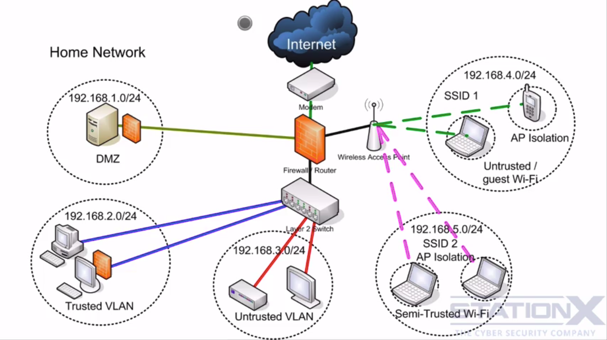
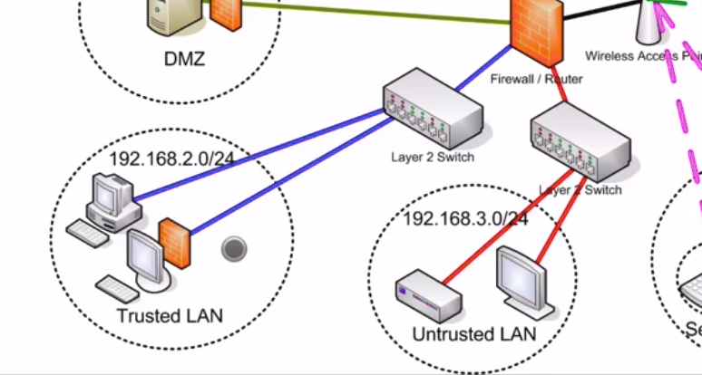

# Network Attacks, Archtecture and Isolation

## Isolation
Separate devices on the network.

If one is compromised, it can't propagate to other devices.

## ARP Spoofing
### Switch
Switches prevent sniffing by setting a port for each device connected, using the MAC address. Only the specified device receives the specified traffic.

Switches can be fooled to mirror traffic to all ports or by ARP poisoning.

### Hub
Sends the traffic to everybody, so it is possible to do ARP spoofing.

    ARP - Address Resolution Protocol  
    Resolves IP addresses (network layer) to MAC addresses (data link layer)

`arp -a`  
Display hosts

When a device wants to communicate with another device in the network, it requests the device MAC address of that IP address and saves it on the ARP table.

    arpspoof  
    ethercap  
    cain and able  

These tools tell the requester that they are the requested device.

This can happen because ARP don't have authentication, it was developed in a time it was believed all devices were trusted.

More info - http://www.irongeek.com/i.php?page=security/AQuickIntrotoSniffers

"In monitor mode, the wireless network card listens to the raw packets in the radio waves without ever having to attach to a WAP. The nice thing about monitor mode from the attacker's perspective is that they leave no logs of their activities since they don't have to attach to the WAP and don't have to send any packets on the network."

**Wireshark**  
"Every system admin would do well to **learn about using sniffers to find network problems** and I'd recommend starting with Wireshark since it's free, multiplatform and well supported"

"A few **sniffers** that have **good password extraction abilities** include Cain, Dsniff and Ettercap."

## Isolating network

**DMZ**  
Create an isolated group to receive inbound connections from the internet. These are ate more risk, so should be separated from the other devices.

**VLAN**  
They separate devices. A group will have no idea the other groups exists in the same network.

May be spoof by a technique called VPN hopping, can flooding, STP, DTP  
**Yersinia** - VPN hopping (on Kali)

### ARP protection 

- Software

    Netcut  
    Tuxcut  
    Sniffdet  
    xarp  
    Arpwatch  

- Use static ARP

#### Highend solutions
- Cisco - Port Security (Port protection)
- 802.1AE (IEEE MAC Security standard) - Authentication and Encryption
- IEEE 802.1X - port-based Network Access Control (PNAC) - Authentication
- DHCP Snooping - Watches DHCP addresses requests and saves a table to solve MAC addresses
